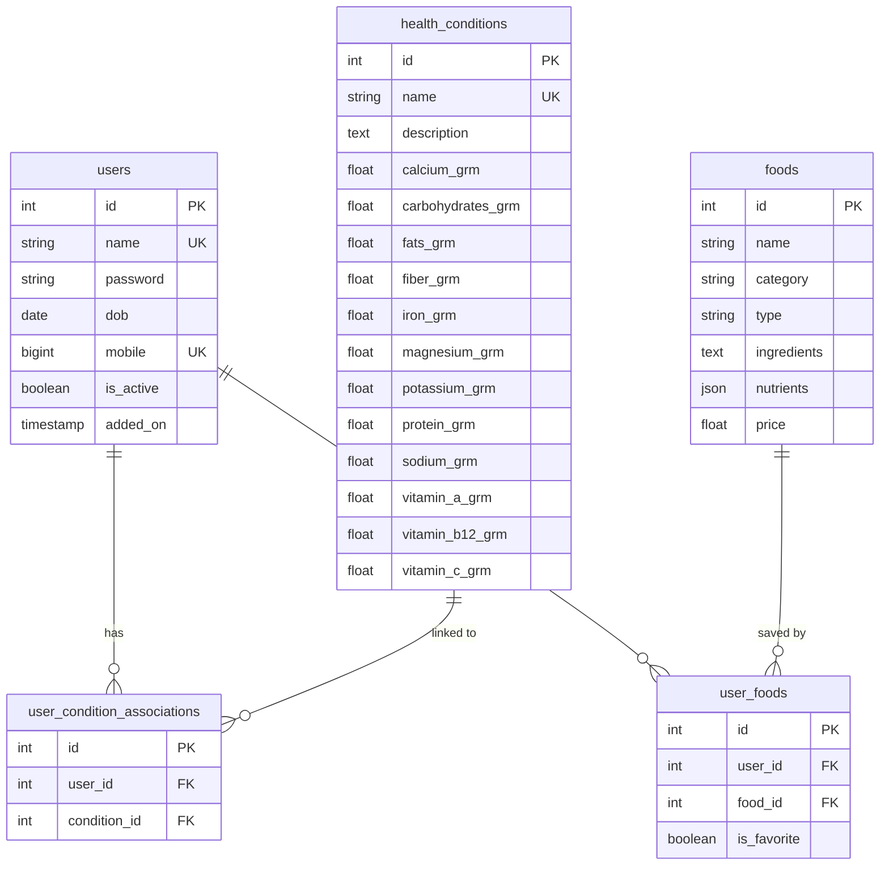

# 🍎 Food Recommendation System

A personalized food recommendation system that uses **KNN (K-Nearest Neighbors)** machine learning algorithm to suggest foods based on user health conditions. Built with **FastAPI**, **PostgreSQL**, **Streamlit**, and **scikit-learn**.

---

## ✨ Features

- **🤖 AI-Powered Recommendations** — KNN-based engine with cosine similarity, percentage matching, and hybrid scoring methods
- **🏥 Health-Based Personalization** — 9 supported health conditions (Diabetes, Hypertension, Heart Disease, etc.) with specific nutrient requirements
- **📊 Nutrient Analysis** — Tracks 6+ nutrients (Carbohydrates, Fats, Fiber, Protein, Sodium, Sugar) for matching
- **🍽️ 1,000+ Food Database** — Categorized food items with complete nutritional data and pricing
- **🥗 Veg/Non-Veg Filtering** — Separate recommendation tabs for dietary preferences
- **🔐 JWT Authentication** — Secure login/registration with access & refresh tokens, bcrypt password hashing
- **👤 User Profiles** — Profile management, password change, and account settings
- **📱 Responsive Dashboard** — Streamlit-based UI with floating sidebar, card/table views, and interactive filters

---

## 🏗️ Tech Stack

| Layer          | Technology                                       |
| -------------- | ------------------------------------------------ |
| **Backend**    | FastAPI, Uvicorn                                 |
| **Frontend**   | Streamlit (Multi-page app)                       |
| **Database**   | PostgreSQL, SQLAlchemy ORM                       |
| **ML Engine**  | scikit-learn (KNN, StandardScaler), NumPy, Pandas|
| **Auth**       | JWT (python-jose), bcrypt (passlib)              |
| **Config**     | Pydantic Settings, python-dotenv                 |
| **Python**     | 3.11+                                            |

---

## 📁 Project Structure

```
food-recomendation-system-v1.2/
├── main.py                      # FastAPI app entrypoint
├── pyproject.toml               # Project config & dependencies
├── requirement.txt              # Pip requirements
├── .env                         # Environment variables
│
├── backend/
│   ├── config.py                # App settings (DB, JWT, etc.)
│   ├── models/
│   │   └── custom_tables.py     # SQLAlchemy models (User, Food, HealthCondition, etc.)
│   ├── routers/
│   │   ├── auth.py              # Login, logout, refresh token, profile
│   │   ├── user.py              # Registration, profile update, password change
│   │   ├── food.py              # Food CRUD, search, pagination
│   │   ├── health.py            # Health conditions management
│   │   └── recommendation.py   # AI recommendation endpoints
│   ├── schema/                  # Pydantic request/response models
│   ├── services/
│   │   └── knn_recommender.py   # KNN recommendation engine
│   └── utils/
│       ├── auth.py              # JWT & password utilities
│       ├── database.py          # SQLAlchemy engine & session
│       ├── logger.py            # Custom logging
│       └── constants.py         # App constants
│
├── frontend/
│   ├── app.py                   # Streamlit main app & landing page
│   ├── pages/
│   │   ├── login.py             # User login
│   │   ├── register.py          # User registration with health condition
│   │   ├── logout.py            # Logout handler
│   │   ├── profile.py           # User profile management
│   │   ├── health_conditions.py # Health condition selection
│   │   ├── all_foods.py         # Browse food catalog
│   │   └── recommendations.py  # AI recommendations (Veg/Non-Veg/All)
│   └── utils/
│       └── api_client.py        # HTTP client for backend API
│
├── data/
│   ├── Food_nutrition.csv       # Food items with nutritional data
│   ├── Health_Condition.csv     # Health conditions & nutrient requirements
│   └── normalized_health_conditions.csv
│
└── scripts/
    ├── load_data.py             # Database seeder (CSV → PostgreSQL)
    ├── create_tables.py         # Table creation script
    ├── cosine_similarity.py     # Standalone similarity analysis
    ├── algorithem_explaination.py # Algorithm documentation
    ├── create_health_condition.py
    └── check_data_files.py
```

---

## 🚀 Getting Started

### Prerequisites

- **Python 3.11+**
- **PostgreSQL** (running locally or remote)
- **pip** or **uv** package manager

### 1. Clone the Repository

```bash
git clone https://github.com/Krishnamalgi7/Food_recommendation.git
cd Food_recommendation
```

### 2. Create Virtual Environment

```bash
python -m venv .venv

# Windows
.venv\Scripts\activate

# macOS/Linux
source .venv/bin/activate
```

### 3. Install Dependencies

```bash
pip install -r requirement.txt
```

Or with **uv**:

```bash
uv sync
```

### 4. Configure Environment Variables

Create a `.env` file in the project root:

```env
# Database Configuration
DATABASE_USER=postgres
DATABASE_PASSWORD=your_password
DATABASE_HOST=localhost
DATABASE_PORT=5432
DATABASE_NAME=postgres

# JWT Configuration
SECRET_KEY=your-secret-key-here
ALGORITHM=HS256
ACCESS_TOKEN_EXPIRE_MINUTES=30
REFRESH_TOKEN_EXPIRE_DAYS=7

# Application Configuration
APP_NAME=Food Recommendation System
DEBUG=True
```

### 5. Set Up Database

Ensure PostgreSQL is running, then load the data:

```bash
python scripts/load_data.py
```

This will create all tables and seed the database with:
- **9 health conditions** from `Health_Condition.csv`
- **1,000+ food items** from `Food_nutrition.csv`

### 6. Run the Application

**Start the Backend (FastAPI):**

```bash
uvicorn main:app --reload --host 0.0.0.0 --port 8000
```

**Start the Frontend (Streamlit):**

```bash
cd frontend
streamlit run app.py
```

| Service   | URL                          |
| --------- | ---------------------------- |
| Backend   | http://localhost:8000        |
| API Docs  | http://localhost:8000/docs   |
| Frontend  | http://localhost:8501        |

---

## 🔌 API Endpoints

### Authentication

| Method | Endpoint           | Description              |
| ------ | ------------------ | ------------------------ |
| POST   | `/auth/login`      | User login               |
| POST   | `/auth/refresh`    | Refresh access token     |
| GET    | `/auth/me`         | Get user profile         |
| POST   | `/auth/logout`     | Logout                   |

### Users

| Method | Endpoint                          | Description                       |
| ------ | --------------------------------- | --------------------------------- |
| POST   | `/users/`                         | Register new user                 |
| POST   | `/users/register-with-condition`  | Register with health condition    |
| GET    | `/users/me`                       | Get current user info             |
| PUT    | `/users/me`                       | Update profile                    |
| PUT    | `/users/change-password`          | Change password                   |
| DELETE | `/users/me`                       | Deactivate account                |

### Food

| Method | Endpoint                  | Description                      |
| ------ | ------------------------- | -------------------------------- |
| GET    | `/food/all`               | Get all foods (paginated)        |
| GET    | `/food/get_all`           | Get all foods (legacy)           |
| POST   | `/food/create`            | Batch insert foods               |
| GET    | `/food/{name}`            | Search food by name              |
| GET    | `/food/category/{name}`   | Search by category               |

### Health Conditions

| Method | Endpoint                     | Description                  |
| ------ | ---------------------------- | ---------------------------- |
| GET    | `/health_condition/`         | List all health conditions   |
| GET    | `/health_condition/{id}`     | Get specific condition       |
| POST   | `/health_condition/batch`    | Batch insert conditions      |

### Recommendations

| Method | Endpoint                            | Description                         |
| ------ | ----------------------------------- | ----------------------------------- |
| POST   | `/recommendations/user-conditions`  | Set user health conditions          |
| GET    | `/recommendations/user-conditions`  | Get user health conditions          |
| POST   | `/recommendations/generate`         | Generate AI recommendations         |
| GET    | `/recommendations/categories`       | Get available food categories       |

---

## 🧠 How the Recommendation Algorithm Works

The system uses an **Improved KNN Food Recommender** with magnitude-based scoring:

1. **Data Loading** — Food nutrient data is loaded from PostgreSQL into a Pandas DataFrame
2. **User Profile** — Nutrient requirements are calculated by aggregating the user's health conditions and normalizing per meal (3 meals/day)
3. **Feature Scaling** — Food and user nutrient vectors are standardized using `StandardScaler`
4. **KNN Search** — `NearestNeighbors` (Ball Tree, Euclidean distance) finds the closest food items to the user's ideal nutrient profile
5. **Scoring** — Each candidate food is scored using one of three methods:
   - **Cosine** — Measures nutritional proportion similarity (direction of vectors)
   - **Percentage** — Measures absolute nutrient match ratio
   - **Hybrid** (default) — 60% cosine + 40% percentage for balanced scoring
6. **Filtering** — Results can be filtered by food type (Veg/Non-Veg) and category
7. **Ranking** — Foods are sorted by match score (descending) and top N are returned

### Nutrient Features Used

`Carbohydrates`, `Fats`, `Fiber`, `Protein`, `Sodium`, `Sugar`

Priority nutrients receive **2x weight** in the scoring algorithm.

---

## 🗄️ Database Schema



---

## 📄 License

This project is for educational purposes.

---

## 🙏 Acknowledgements

- Built with [FastAPI](https://fastapi.tiangolo.com/), [Streamlit](https://streamlit.io/), and [scikit-learn](https://scikit-learn.org/)
- Food nutrition dataset with 1,000+ items
- Health condition nutrient requirements based on dietary guidelines
