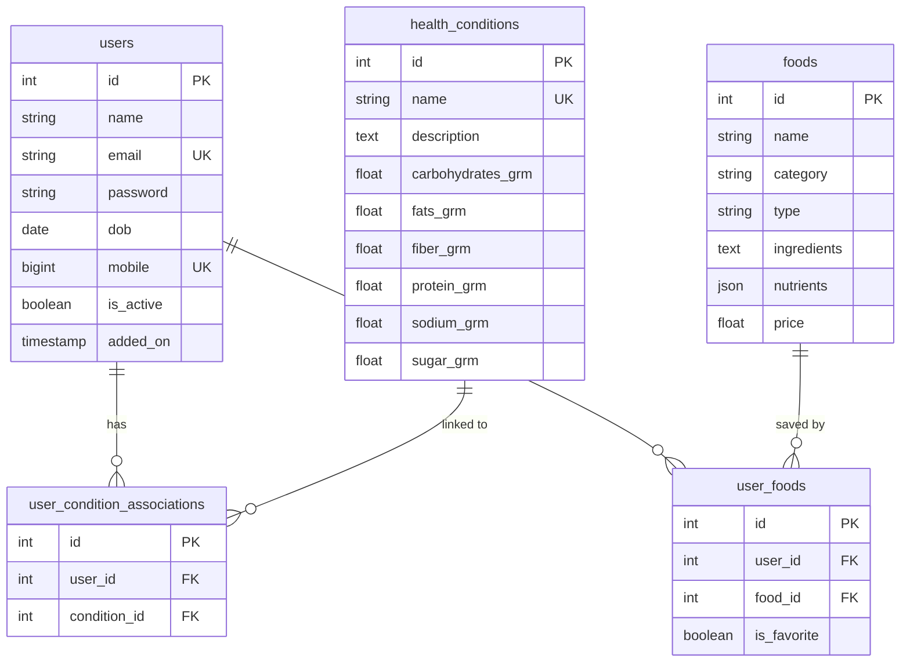

# 🍎 Food Recommendation System

A personalized food recommendation system that uses **KNN (K-Nearest Neighbors)** machine learning to suggest foods based on user health conditions. Built with **FastAPI**, **PostgreSQL**, **Streamlit**, and **scikit-learn**.

---

## ✨ Features

- **🤖 AI-Powered Recommendations** — KNN engine with cosine similarity, percentage matching, and hybrid scoring
- **🏥 Health-Based Personalization** — 9 health conditions (Diabetes, Hypertension, Heart Disease, etc.) each with specific nutrient targets
- **📊 Nutrient Matching** — Tracks 6 active nutrients: `Carbohydrates`, `Fats`, `Fiber`, `Protein`, `Sodium`, `Sugar`
- **🍽️ 1,000+ Food Database** — Categorized food items with complete nutritional data and pricing
- **🥗 Veg / Non-Veg Filtering** — Separate recommendation views for dietary preferences
- **🔐 Email-Based JWT Authentication** — Login and registration use **email + password**. Tokens are JWT (access + refresh) with bcrypt password hashing
- **👤 User Profiles** — Profile management, password change, and account settings
- **📱 Responsive Dashboard** — Streamlit multi-page app with floating sidebar, card/table views, and interactive filters

---

## 🏗️ Tech Stack

| Layer         | Technology                                        |
| ------------- | ------------------------------------------------- |
| **Backend**   | FastAPI, Uvicorn                                  |
| **Frontend**  | Streamlit (Multi-page app)                        |
| **Database**  | PostgreSQL, SQLAlchemy ORM                        |
| **ML Engine** | scikit-learn (KNN, StandardScaler), NumPy, Pandas |
| **Auth**      | JWT (python-jose), bcrypt (passlib), EmailStr     |
| **Config**    | Pydantic Settings, python-dotenv                  |
| **Python**    | 3.11+                                             |

---

## 📁 Project Structure

```
food-recomendation-system-v1.2/
├── main.py                          # FastAPI app entrypoint
├── pyproject.toml                   # Project config & dependencies
├── requirement.txt                  # Pip requirements
├── .env                             # Environment variables (not committed)
│
├── backend/
│   ├── config.py                    # App settings (DB URL, JWT secrets, etc.)
│   ├── models/
│   │   └── custom_tables.py         # SQLAlchemy ORM models
│   ├── routers/
│   │   ├── auth.py                  # Login, logout, token refresh, /me profile
│   │   ├── user.py                  # Registration, profile update, password change
│   │   ├── food.py                  # Food CRUD, search, pagination
│   │   ├── health.py                # Health conditions management
│   │   └── recommendation.py        # AI recommendation endpoints
│   ├── schema/
│   │   ├── auth.py                  # LoginRequest, LoginResponse, UserProfile
│   │   ├── user.py                  # UserCreate, UserResponse, UserUpdate
│   │   ├── health.py                # Health, HealthConditionResponse
│   │   └── recommendation.py        # RecommendationRequest/Response
│   ├── services/
│   │   └── knn_recommender.py       # KNN recommendation engine
│   └── utils/
│       ├── auth.py                  # JWT creation/decoding, get_current_user
│       ├── database.py              # SQLAlchemy engine & session
│       ├── logger.py                # Custom logging
│       └── constants.py             # Nutrient & HealthCondition enums
│
├── frontend/
│   ├── app.py                       # Streamlit landing page & session init
│   ├── pages/
│   │   ├── login.py                 # Email + password login form
│   │   ├── register.py              # Registration: Full Name, Email, DOB, Mobile
│   │   ├── logout.py                # Logout confirmation & session cleanup
│   │   ├── profile.py               # View & edit user profile
│   │   ├── health_conditions.py     # Health condition selection/update
│   │   ├── all_foods.py             # Browse full food catalog
│   │   └── recommendations.py       # AI recommendations (Veg/Non-Veg/All tabs)
│   └── utils/
│       └── api_client.py            # HTTP client wrapper for backend API
│
├── data/
│   ├── Food_nutrition.csv           # Food items with nutritional data
│   └── Health_Condition.csv         # Health conditions & per-disease nutrient targets
│
└── scripts/
    ├── load_data.py                 # Database seeder — CSV → PostgreSQL
    ├── create_tables.py             # Standalone table creation script
    ├── migrate_add_email.py         # Migration: add email column to users
    ├── migrate_add_sugar_grm.py     # Migration: add & backfill sugar_grm in health_conditions
    ├── migrate_drop_legacy_nutrients.py  # Migration: drop 7 unused nutrient columns
    ├── cosine_similarity.py         # Standalone similarity analysis script
    ├── algorithem_explaination.py   # Algorithm documentation script
    └── check_data_files.py          # Validate CSV files before loading
```

---

## 🚀 Getting Started

### Prerequisites

- **Python 3.11+**
- **PostgreSQL** (running locally or remote)
- **pip** or **uv** package manager

### 1. Clone the Repository

```bash
git clone https://github.com/Krishnamalgi7/Food_recommendation.git
cd Food_recommendation
```

### 2. Create Virtual Environment

```bash
python -m venv .venv

# Windows
.venv\Scripts\activate

# macOS / Linux
source .venv/bin/activate
```

### 3. Install Dependencies

```bash
pip install -r requirement.txt
```

> **Note:** `pydantic[email]` (the `email-validator` package) is required for email validation. It is listed as a transitive dependency via `pydantic>=2.5.3`. If you see an `ImportError: email-validator is not installed`, run:
> ```bash
> pip install "pydantic[email]"
> ```

Or with **uv**:

```bash
uv sync
```

### 4. Configure Environment Variables

Create a `.env` file in the **project root**:

```env
# Database
DATABASE_USER=postgres
DATABASE_PASSWORD=your_password
DATABASE_HOST=localhost
DATABASE_PORT=5432
DATABASE_NAME=postgres

# JWT
SECRET_KEY=your-secret-key-here-change-in-production
ALGORITHM=HS256
ACCESS_TOKEN_EXPIRE_MINUTES=30
REFRESH_TOKEN_EXPIRE_DAYS=7

# Application
APP_NAME=Food Recommendation System
DEBUG=True
```

### 5. Seed the Database

Ensure PostgreSQL is running, then:

```bash
python scripts/load_data.py
```

This creates all tables automatically and seeds:
- **9 health conditions** from `Health_Condition.csv` (with per-disease nutrient targets)
- **1,000+ food items** from `Food_nutrition.csv`

> **Fresh install only.** If the tables already contain data, the seeder skips insertion.

### 6. Run the Application

> On Windows with a virtual environment, use `python -m` to avoid PATH issues with the `.venv` launcher.

**Backend (FastAPI):**

```bash
# From project root
python -m uvicorn main:app --reload --host 0.0.0.0 --port 8000
```

**Frontend (Streamlit):**

```bash
# From project root
python -m streamlit run frontend/app.py

# Or from the frontend directory
cd frontend
python -m streamlit run app.py
```

| Service  | URL                        |
| -------- | -------------------------- |
| Backend  | http://localhost:8000      |
| API Docs | http://localhost:8000/docs |
| Frontend | http://localhost:8501      |

---

## 🔐 Authentication

Authentication is **email-based**. There is no "username" login.

| Action           | Field(s) required                                          |
| ---------------- | ---------------------------------------------------------- |
| **Register**     | Full Name, **Email**, Password, Date of Birth, Mobile, Health Condition |
| **Login**        | **Email**, Password                                        |
| **JWT payload**  | `sub` = user's email address                               |

Tokens are returned as `access_token` + `refresh_token` (Bearer scheme).  
The `access_token` expires after 30 minutes; use `POST /auth/refresh` to renew it.

---

## 🔌 API Endpoints

### Authentication

| Method | Endpoint        | Auth required | Description          |
| ------ | --------------- | ------------- | -------------------- |
| POST   | `/auth/login`   | No            | Login with email + password |
| POST   | `/auth/refresh` | No            | Refresh access token |
| GET    | `/auth/me`      | Yes           | Get current user profile |
| POST   | `/auth/logout`  | Yes           | Logout               |

### Users

| Method | Endpoint                         | Auth required | Description                    |
| ------ | -------------------------------- | ------------- | ------------------------------ |
| POST   | `/users/`                        | No            | Register new user              |
| POST   | `/users/register-with-condition` | No            | Register + assign health condition |
| GET    | `/users/me`                      | Yes           | Get current user info          |
| PUT    | `/users/me`                      | Yes           | Update name, DOB, mobile       |
| PUT    | `/users/change-password`         | Yes           | Change password                |
| DELETE | `/users/me`                      | Yes           | Deactivate account             |

### Food

| Method | Endpoint                | Auth required | Description                   |
| ------ | ----------------------- | ------------- | ----------------------------- |
| GET    | `/food/all`             | Yes           | List all foods (paginated)    |
| GET    | `/food/{name}`          | Yes           | Search food by name           |
| GET    | `/food/category/{name}` | Yes           | Filter foods by category      |
| POST   | `/food/create`          | Yes           | Batch insert foods            |

### Health Conditions

| Method | Endpoint                  | Auth required | Description                  |
| ------ | ------------------------- | ------------- | ---------------------------- |
| GET    | `/health_condition/`      | No            | List all health conditions   |
| GET    | `/health_condition/{id}`  | No            | Get a specific condition     |
| POST   | `/health_condition/batch` | Yes           | Batch insert conditions      |

### Recommendations

| Method | Endpoint                           | Auth required | Description                        |
| ------ | ---------------------------------- | ------------- | ---------------------------------- |
| POST   | `/recommendations/user-conditions` | Yes           | Set user's health condition(s)     |
| GET    | `/recommendations/user-conditions` | Yes           | Get user's current condition(s)    |
| POST   | `/recommendations/generate`        | Yes           | Generate AI food recommendations   |
| GET    | `/recommendations/categories`      | Yes           | List available food categories     |

---

## 🧠 How the Recommendation Algorithm Works

The system uses an **Improved KNN Food Recommender** with magnitude-based scoring:

1. **Data Loading** — Food nutrient data is loaded from PostgreSQL into a Pandas DataFrame on first use
2. **User Requirements** — Nutrient targets are calculated by averaging the user's health condition requirements and dividing by 3 meals/day  
   - Example: Diabetes → Carbohydrates = 180g/day ÷ 3 = **60g/meal**
3. **Feature Scaling** — Both food vectors and the user vector are standardized using `StandardScaler`
4. **KNN Search** — `NearestNeighbors` (Ball Tree, Euclidean distance) finds the top `3×N` candidate foods closest to the user's nutrient profile
5. **Re-ranking** — Each candidate is re-scored using one of three methods on the **raw (unscaled)** values:
   - **Cosine** — Measures nutritional proportion similarity (vector angle)
   - **Percentage** — Measures absolute nutrient coverage ratio
   - **Hybrid** (default) — 60% cosine + 40% percentage for balanced scoring
6. **Filtering** — Results can be filtered by food type (`Veg` / `Non-Veg`) and category
7. **Ranking** — Foods are sorted by match score (descending); top N are returned

### Active Nutrient Features

| Feature         | Source in `health_conditions` |
| --------------- | ----------------------------- |
| `Carbohydrates` | `carbohydrates_grm`           |
| `Fats`          | `fats_grm`                    |
| `Fiber`         | `fiber_grm`                   |
| `Protein`       | `protein_grm`                 |
| `Sodium`        | `sodium_grm`                  |
| `Sugar`         | `sugar_grm`                   |

All 6 features are weighted equally (`weight = 2.0`) in the scoring step.

---

## 🗄️ Database Schema


```mermaid
erDiagram
    users ||--o{ user_condition_associations : has
    users ||--o{ user_foods : saves
    health_conditions ||--o{ user_condition_associations : "linked to"
    foods ||--o{ user_foods : "saved by"

    users {
        int id PK
        string name
        string email UK
        string password
        date dob
        bigint mobile UK
        boolean is_active
        timestamp added_on
    }

    health_conditions {
        int id PK
        string name UK
        text description
        float carbohydrates_grm
        float fats_grm
        float fiber_grm
        float protein_grm
        float sodium_grm
        float sugar_grm
    }

    foods {
        int id PK
        string name
        string category
        string type
        text ingredients
        json nutrients
        float price
    }

    user_condition_associations {
        int id PK
        int user_id FK
        int condition_id FK
    }

    user_foods {
        int id PK
        int user_id FK
        int food_id FK
        boolean is_favorite
    }
```

---

## 🛠️ Database Migrations

If you are upgrading an **existing installation** (rather than seeding fresh), run the migration scripts in order:

```bash
# 1. Add email column to users (required for email-based auth)
python scripts/migrate_add_email.py

# 2. Add sugar_grm to health_conditions and backfill from CSV
python scripts/migrate_add_sugar_grm.py

# 3. Drop the 7 legacy nutrient columns (always 0, never used)
python scripts/migrate_drop_legacy_nutrients.py
```

Each script is **idempotent** — it checks whether the change is already applied before executing.

---

## 🏥 Supported Health Conditions

| ID | Condition   | Sugar target | Carbs target | Protein target |
| -- | ----------- | ------------ | ------------ | -------------- |
| 1  | Skin        | 50 g/day     | 250 g/day    | 70 g/day       |
| 2  | BP          | 30 g/day     | 200 g/day    | 75 g/day       |
| 3  | Diabetes    | 20 g/day     | 180 g/day    | 80 g/day       |
| 4  | Heart       | 25 g/day     | 200 g/day    | 85 g/day       |
| 5  | Kidney      | 20 g/day     | 180 g/day    | 65 g/day       |
| 6  | Liver       | 35 g/day     | 250 g/day    | 70 g/day       |
| 7  | Lung        | 25 g/day     | 230 g/day    | 60 g/day       |
| 8  | PCOD        | 25 g/day     | 200 g/day    | 75 g/day       |
| 9  | Gastroloty  | 20 g/day     | 190 g/day    | 65 g/day       |

*All values are sourced from `data/Health_Condition.csv`. The KNN engine divides daily targets by 3 to get per-meal recommendations.*

---

## 🚀 Future Enhancements

The current system provides personalized food recommendations based on health conditions and nutritional similarity. Planned improvements include:

- **🤖 Personalized Recommendations**
  - Learn from user interactions such as likes, dislikes, and frequently selected foods to improve future recommendations.

- **💡 Explainable AI Recommendations**
  - Display why each food was recommended (e.g., *"High in protein and low in sodium, making it suitable for your selected health condition."*).

- **🍽️ Meal Planning**
  - Generate complete breakfast, lunch, and dinner plans instead of recommending individual foods.

- **🐳 Docker Support**
  - Containerize the application using Docker and Docker Compose for one-command deployment.

- **☁️ Cloud Deployment**
  - Deploy the application on platforms such as Render, Railway, or AWS with CI/CD for automated testing and deployment.

- **📈 Recommendation Analytics**
  - Track recommendation accuracy, user preferences, and popular food trends through an analytics dashboard.

- **🩺 Multi-Condition Optimization**
  - Improve recommendation logic for users with multiple health conditions by dynamically balancing nutritional priorities.

---

## 📄 License

This project is for educational purposes.

--- 

## 🙏 Acknowledgements

- Built with [FastAPI](https://fastapi.tiangolo.com/), [Streamlit](https://streamlit.io/), and [scikit-learn](https://scikit-learn.org/)
- Food nutrition dataset with 1,000+ items
- Health condition nutrient requirements based on dietary guidelines
